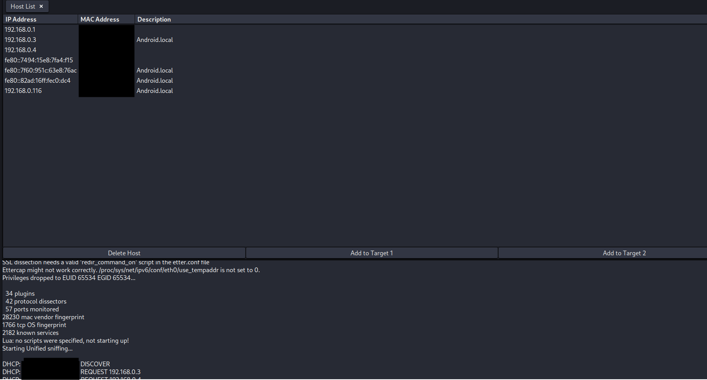
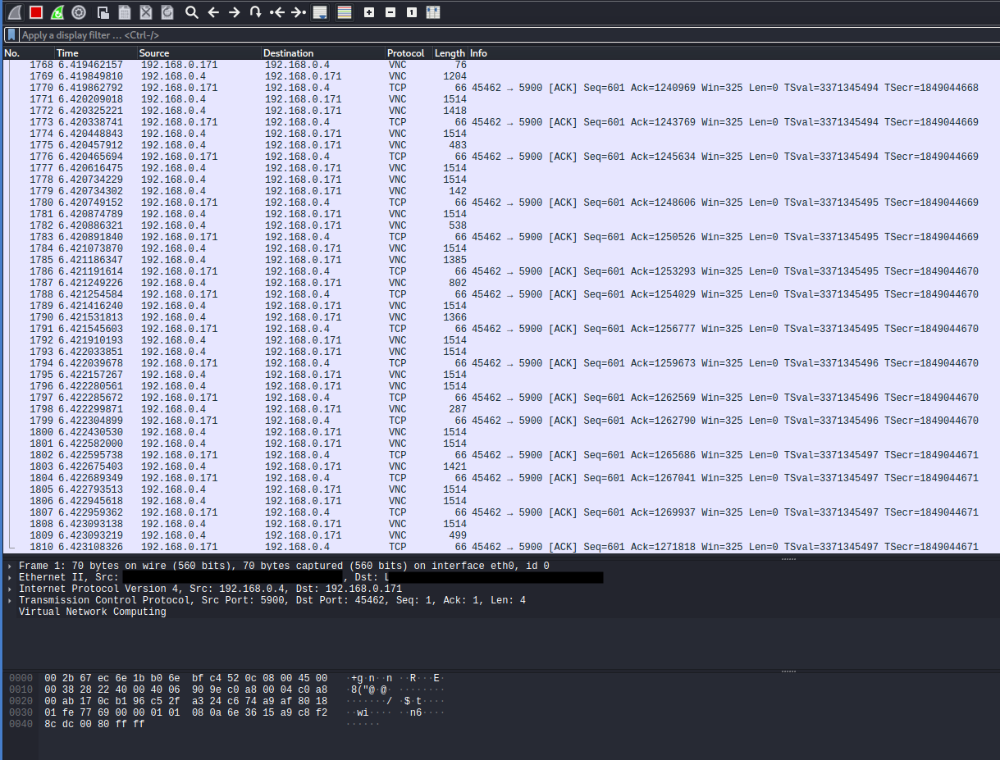

* TOC
{:toc}

<!-- use order of kali linux xdg-menu to organize -->
<!-- openVAS ?-->

# Conducting a Penetration Test on a Small Network

The aim is to demonstrate my usage of important ethical hacking and penetration testing tools, to show the methodology and organized execution using benchmarks, guidelines, etc. Documentation on this process is done thoroughly, and some important files(eg-scan reports) are available in this repository directory structure. I also aim to demonstrate my theoretical knowledge on operating systems and computer networks.

Results from this penetration test were used to secure the network devices and systems on it in the next project [Hardening a Small Network](https://elvindsouza.github.io/hardening/)

---

# Planning and Reconnaissance

if someone were to gain access to the network one way or the other, the first thing they'd do would be enumerating and mapping the network.

The methodology of the entire process would be considered **White Box Testing**

Following the guidelines from [the PCI Security Standards Council](https://www.pcisecuritystandards.org/documents/Penetration-Testing-Guidance-v1_1.pdf)

# Port Scanning and Network Discovery

## Nmap

A SYN(stealth) scan can be performed, preferably with the OS detection flag enabled


After enumerating hosts, you can craft a scan individually based on the host type


## Netdiscover


## Nessus

After the setup, the first thing you want to run is a Host Discovery Scan

After seeing all the hosts on the network, you start a basic network scan on all the hosts. It will take some time to complete, based on the operating system and number of hosts


<!-- attach report -->

# Gaining Access

First, the goal is to attack the Availability (see [CIA triad](https://www.nccoe.nist.gov/publication/1800-25/VolA/index.html)) on this network.

## hping

We use this command-line oriented TCP/IP packet assembler/analyzer to set up a denial-of-service(Dos) attack on a server system.

To view a list of all available options and their usage-

`hping3 --help`

Here, we will run the following on a machine with a high enough link speed

`# hping3 -S -d 1000 --flood --rand-source 192.168.0.4`

```
-S              SYN flag
-d              data size
--flood         send packets as fast as possible
--rand-source   assume a random source address for these packets
```

We can target a specific port with the `-p <port>` flag

We see that the server becomes unusable during this attack. Remediation is discussed in the [](#analysis-and-reporting) section at the end

## John the Ripper

In the case that the intruder gains physical access to the computer or exploits a service with elevated permissions for its service account, he might go for the `/etc/shadow` file containing information about users and accompanying passwords on the system.

```

┌──(user@user)-[~]
└─$ s tail /etc/shadow
beef-xss:_:19030:0:99999:7:::
king-phisher:_:19030:0:99999:7:::
\_caldera:_:19030:0:99999:7:::
user:$y$j9T$znRa/I4zvH8rjS/QbrhiL/$KBpcdTDvskDWYXYHLvSZpIkvFjLFbb9PRNra/v4ER1/:19151:0:99999:7:::
nvpd:_:19041:0:99999:7:::
cntlm:!:19134::::::
\_sentrypeer:!:19134::::::
gpsd:!:19134::::::
\_juice:!:19134::::::
\_dvwa:!:19134::::::

```

Using the `unshadow` command(it is supplied with `John`),
combine the `/etc/passwd` and `/etc/shadow` files so that they can be cracked with John


Remediation is discussed in the [Network Hardening](https://elvindsouza.github.io/hardening/) documentation, under [Least Privilege](https://elvindsouza.github.io/hardening/#least-privilege)

## Wireshark

Now we will attack the confidentiality of the information in transit over the network.
From [Wireshark's Documentation on Ethernet Sniffing](https://wiki.wireshark.org/CaptureSetup/Ethernet)

Conducting a Man-in-the-Middle attack (MITM), using ARP poisoning. In the screenshot below, we can select the server and client system as the two targets, and begin the attack.





Now we return to Wireshark and sniff intercepted traffic. In the screenshot, we have intercepted unencrypted VNC (virtual desktop) communication. With the proper tools, we can reconstruct this traffic and view the VNC "stream". In this way, we have compromised confidentiality.



## Burp Suite

During this process, I realized that two docker images were set up to start upon system startup. These images are intentionally vulnerable.

Creating a new project in Burp Suite, I set up a proxy to intercept traffic to these web applications.


For one injectable area in one application, the submit button sent a GET to the webserver. This was easy to exploit.


For another web application, the POST was intercepted, and saved to a "[POST.txt](./Resources/POST.txt)" file, and then `sqlmap` was used to pwn this database


The admin login on one of these applications was not changed. The biggest threat of SQL injection, even on a test system, is that it is possible to spawn an OS shell on the database system's underlying operating system.

Thankfully, because of docker's advantages, it would be very unlikely that setting up an attack to allow running shell commands would be reproducible. If these images were run as normal web applications, the DBMS process user would have write privileges to the `/var/www/` directories, etc. This would make it easy to get a shell or execute commands.

## SQLi

While getting a shell/system shell execution was not possible through SQL injection, it was possible to successfully carry out a SQL injection attack on both the webservers

Below, `--dbs` would list databases

`sqlmap --cookie=" PHPSESSID=57upmh3ukcknj75eq45na0cr50; security=low" --url="http://localhost/vulnerabilities/sqli/?id=2&Submit=Submit#" --dbs`


Dump the database "dvwa"

`sqlmap --cookie=" PHPSESSID=57upmh3ukcknj75eq45na0cr50; security=low" --url="http://localhost/vulnerabilities/sqli/?id=2&Submit=Submit#" -D dvwa --dump`

( consult `sqlmap --help` for more options)


## Metasploit Framework

One of the server systems runs an SSH daemon too, and the root password to the machine is incredibly weak, because it is a new install

We will use `msfconsole` to interface to the Metasploit Framework. Here, we use the `auxiliary/scanner/ssh/ssh_login` module


`whoami`? Root!


> _The scope of an attack after getting root is only limited by the attacker's imagination_

# Analysis and Reporting

The Nessus Scans (Available in /Resources/, in .html, .pdf, and .nessus formats) were instrumental in ranking vulnerabilities from most to least critical and addressing them one by one

We see that a simple DoS attack on a server system makes services unusable for everyone. Resist a SYN flood attack by using **SYN cookies**

Services and autostarting applications are a big pathway for attackers to enter a system. Keep a log of configuration changes and services that should be running on systems, and audit these lists once in a while.

Poor configuration and weak credentials would allow an attacker easy access to these systems. Remediation would be to follow security benchmarks from reputable organizations and doing a bit of research on the needed strength of passwords and encryption

_more details are covered in my [subsequent project](https://elvindsouza.github.io/hardening), where I used the results from this process to harden systems on the same network_
